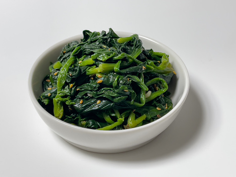
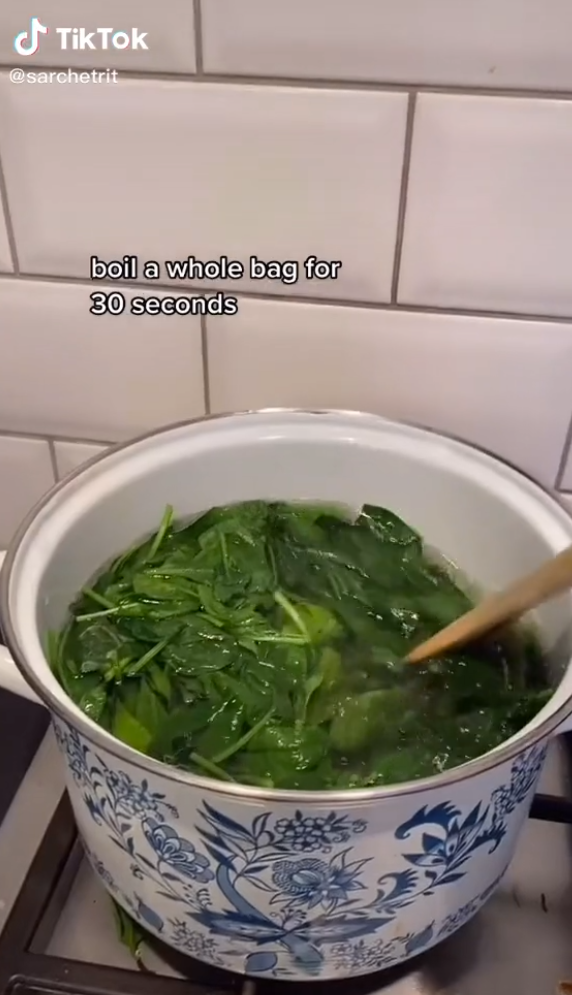

## Recipe Review: Sigeumchi Namul

#### Overview
 Sigeumchi Namul, otherwise known as 'Spinach Banchan', is a Korean side dish that has quickly become one of my favorite vegetable appetizers.
The dish combines blanched spinach with garlic, soy sauce, sesame oil, sugar, and black pepper to transform an otherwise plain vegetable dish into a mouthful of flavor. This was my experience making the dish.

#### Ingredients
- 1 bag of spinach
- 1 minced clove of garlic
- 1 tbsp soy sauce
- 1 tbsp sesame oil
- 1 tsp sugar
- 1/2 tsp black pepper
  
#### My Experience
The recipe I used was from Tiktok user sarchetrit and I found the recipe to be extremely easy to follow. The dish only has so many ingredients and for the flavor it packs, it has become a go-to staple for me to create at a moment's notice. 

The whole bag of spinach is blanched for less than a minute before rinsing in cold water to stop the spinach from cooking any further and retain the vegetable's nutrients. Although it may seem like a lot, the spinach will shrink to a portion fit for 4 people.

The most difficult part of this recipe is wringing the spinach dry. Don't be afraid to get your hands all over that spinach and drain it of all the water. Then when you think you've got most of the water out, wring it again because it just has so much water absorbed! While this step does strain the forearms, it prevents the flavor of the garlic, soy sauce, sesame oil, sugar, and black pepper from being watered down. I learned a way around this is to lightly salt the spinach after boiling it and let the salt absorb some water. But if time is of the essence, then wring like your life depends on it!

Once you're satisfied with how much water is left in the spinach, put the spinach in a mixing bowl and add the soy sauce, sesame oil, minced garlic, sugar, and black pepper. My spinach was nowhere as near as aesthetic as the spinach in the video and I had a ball of spinach that formed from wringing. I decided to separate the ball with a spoon before mixing it with the rest of the ingredients.

And that's it you're done! I like to refrigerate the spinach while I cook other things so it is nice and cold when the rest of the food is ready. I think it makes the spinach taste more refreshing and contrasts the hot entrees. I like the recipe as is but you can change the proportion of ingredients to suit your taste.

#### Check out the original recipe!
https://www.tiktok.com/@sarchetrit/video/7039308521883667718?is_copy_url=1&is_from_webapp=v1

